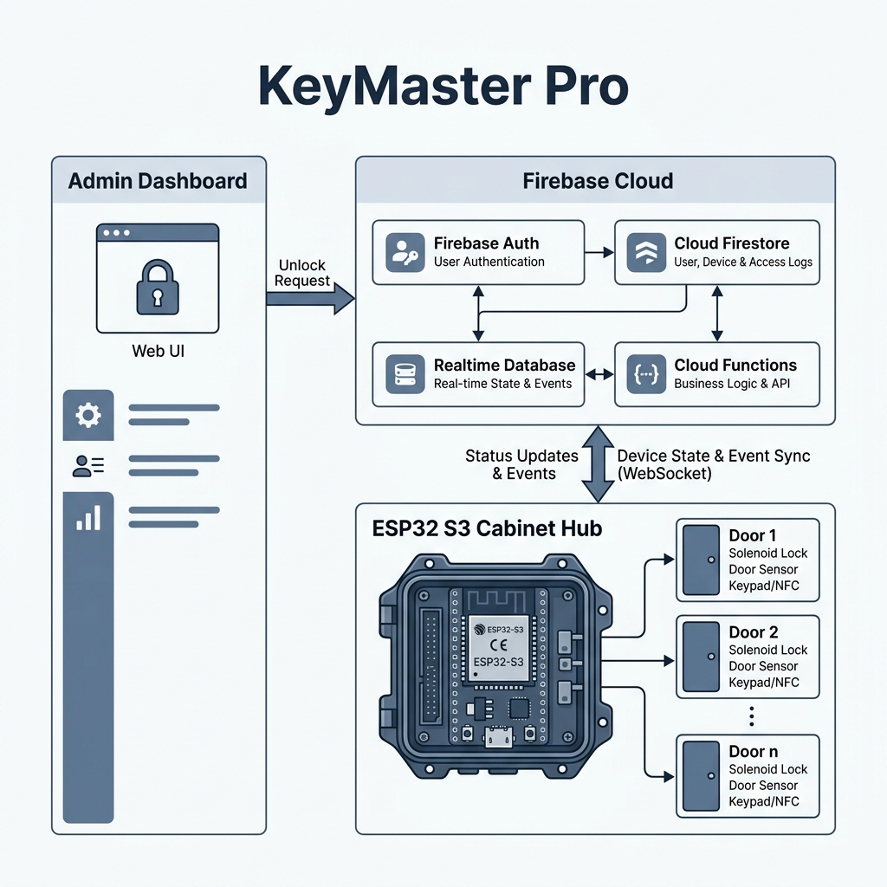

# 🔑 KeyMaster Pro

**KeyMaster Pro** is a high-performance, real-time cabinet management system built with **Next.js 15**, **Firebase**, and **ESP32** hardware. It provides intelligent staff key management with sub-second latency, designed for reliability on the **Firebase Spark Plan**.

## 🚀 Key Features

- **⚡ Real-time Access**: Instant solenoid trigger via Firebase Realtime Database (RTDB).
- **👥 User Management**: Secure Role-Based Access Control (Admin, Staff, Guest) with Google SSO.
- **📋 Smart Inventory**: Live tracking of 10 individual key slots with assignment history.
- **📜 System Audit**: High-efficiency historical logging of all unlocks and system events.
- **📱 Mobile-First UI**: Beautiful, responsive dashboard built with Tailwind CSS and Shadcn UI.
- **📡 Robust IoT**: ESP32 firmware with WiFi Captive Portal for easy network provisioning.

## 🛠️ Tech Stack

- **Frontend**: Next.js 15 (App Router), Tailwind CSS, Lucide Icons, Shadcn UI, Recharts.
- **Backend**: Firebase App Hosting, Firebase Auth (Google), Firebase Firestore, Firebase Realtime Database.
- **Hardware**: ESP32 (Maker Feather AIoT S3), WiFiManager, Firebase-ESP-Client, Adafruit NeoPixel.

## 🏗️ System Architecture

> [!TIP]
> This diagram is stored locally to ensure perfect rendering in all PDF readers and offline environments.

## 🗼 Hardware Connections (Maker Feather AIoT S3)

| Component | GPIO Pin | Mode | Note |
| :--- | :--- | :--- | :--- |
| **Cabinet Lock** | **4** | OUTPUT | Solenoid Signal |
| **Door Switch** | **5** | INPUT | Hall Effect / Micro-switch |
| **Master Key** | **6** | INPUT | Presence & Reset Trigger |
| **Buzzer** | **12** | OUTPUT | Audible Feedback |
| **Status LED** | **2** | OUTPUT | Visual Feedback |
| **RGB LED** | **46** | DATA | WS2812B (RGB Status) |
| **Key Pegs** | **7, 8, 9, 10, 14, 21, 47, 48, 38, 39** | INPUT | 10 Individual Slots |

## 📶 WiFi Setup Instructions

1. Power on the hardware.
2. Connect to the WiFi hotspot named **`KeyMaster_Setup`**.
3. Select your local WiFi network and enter the password in the portal.
4. Once connected, the ESP32 will sync with the cloud and the dashboard.

> [!TIP]
> **Manual WiFi Reset**: To clear saved credentials, hold down the **Master Key (Pin 6)** while powering on the device.

## 📦 Getting Started

### Web Application
1. **Configure Environment**: Copy `.env.example` to `.env.local` and add your Firebase credentials.
2. **Install Dependencies**: `npm install`
3. **Run Locally**: `npm run dev`
4. **Deploy**: `firebase deploy`

### Firmware
1. Open `docs/KeyMaster_ESP_v2/KeyMaster_ESP_v2.ino` in Arduino IDE.
2. Ensure you have the following libraries: `WiFiManager`, `Firebase-ESP-Client`, `Adafruit NeoPixel`.
3. Select **Maker Feather AIoT S3** (or ESP32-S3 Dev Module) as the board.
4. Flash the code to your board.

## 📄 License

Internal use for **KeyMaster Pro** project.

